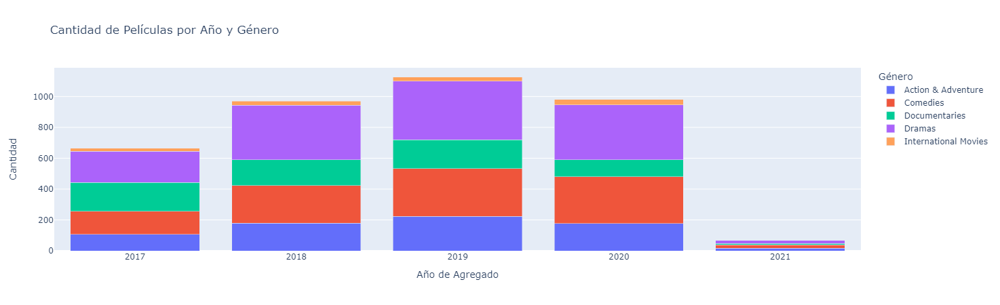
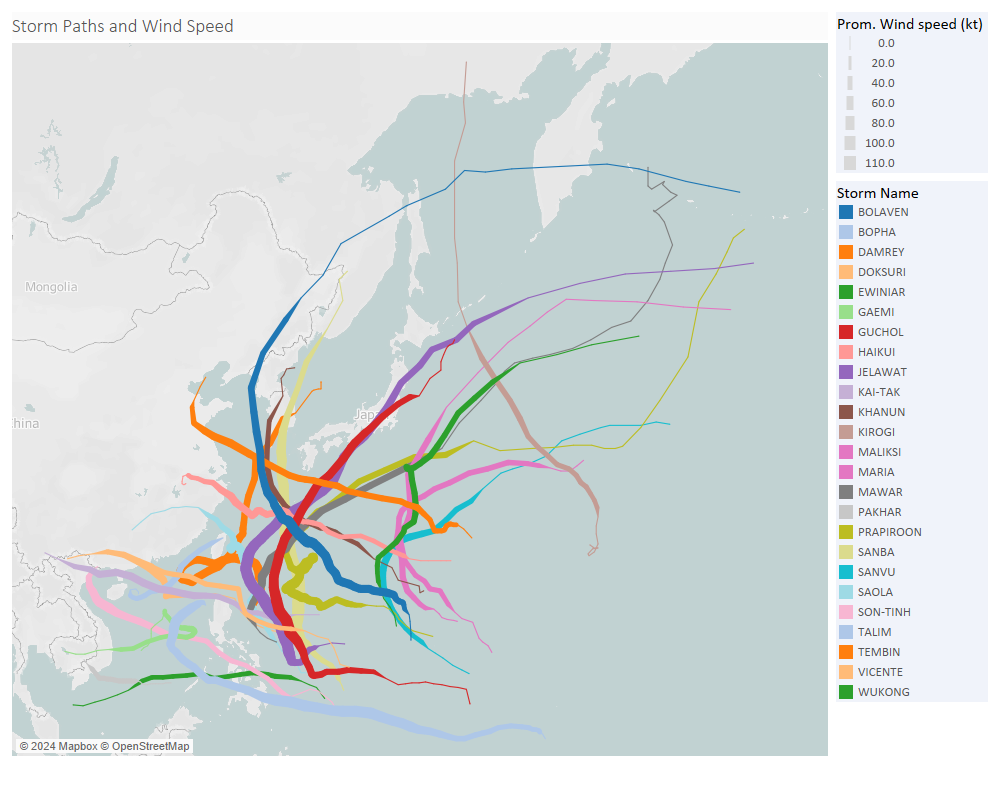
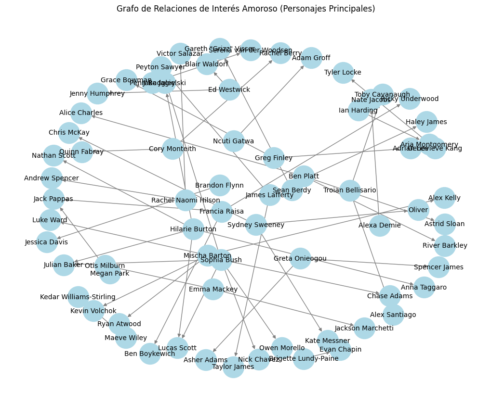

# PEC2_Visualization

## Stacked Bar Graphs
### Definición:
Los gráficos de barras apiladas (Stacked Bar Graphs) son una técnica de visualización que muestra la relación proporcional entre categorías y valores, donde las barras se dividen en segmentos que representan diferentes subcategorías.

### Origen:
La técnica de gráficos de barras apiladas tiene sus orígenes en los gráficos de barras tradicionales, con la adición de segmentación para representar múltiples variables.

### Descripción/Funcionamiento:
En un gráfico de barras apiladas, cada barra representa una categoría, y los segmentos de la barra representan subcategorías de esa categoría. La altura total de la barra representa el valor total de la categoría, y cada segmento muestra la contribución de la subcategoría al total.

### Ejemplos de Aplicación:
Los gráficos de barras apiladas son útiles para comparar partes de un conjunto de datos en relación con el todo. Se utilizan comúnmente en áreas como la economía, la demografía, el marketing y la investigación social.

### Tipo de Datos:
Los gráficos de barras apiladas son adecuados para datos cuantitativos que se pueden dividir en subcategorías. No hay limitaciones específicas en cuanto al tamaño mínimo o máximo del conjunto de datos, pero es importante que los datos sean lo suficientemente desglosados para permitir una comparación significativa entre las subcategorías.

datos: https://www.kaggle.com/datasets/rahulvyasm/netflix-movies-and-tv-shows

## Flow Map
### Definición:
Los mapas de flujo (Flow Map) son una técnica de visualización que muestra el movimiento de objetos o cantidades entre diferentes lugares o regiones.

### Origen:
Los mapas de flujo tienen sus raíces en la cartografía y la visualización de datos geoespaciales, con el objetivo de representar el flujo de personas, bienes, información, etc.

### Descripción/Funcionamiento:
En un mapa de flujo, las líneas o flechas conectan diferentes ubicaciones y representan el flujo de algún tipo de entidad. El grosor o la intensidad de las líneas pueden indicar la cantidad de flujo entre las ubicaciones.

### Ejemplos de Aplicación:
Los mapas de flujo son útiles para visualizar migraciones humanas, rutas comerciales, flujos de tráfico, etc. Se utilizan en campos como la geografía, la logística, la planificación urbana y la demografía.

### Tipo de Datos:
Los mapas de flujo son adecuados para datos cuantitativos que representan cantidades o flujos entre ubicaciones geográficas. No hay limitaciones específicas en cuanto a la estructura de los datos, pero deben incluir información sobre el origen, destino y cantidad de flujo entre ubicaciones.

### Visualización:
Se han representado los datos de tormentas en el sudeste asiático (más concretamente, datos de viento). Estos datos se definen por una posición (latitud, longitud), una fecha, un nombre ed tormenta y velocidad del viento. 

## Hyperbolic Trees
### Definición:
Los árboles hiperbólicos (Hyperbolic Trees) son una técnica de visualización que representa jerarquías de datos de forma radial, donde los nodos se distribuyen en un espacio hiperbólico para enfatizar las relaciones entre ellos.

### Origen:
Los árboles hiperbólicos fueron desarrollados para visualizar grandes estructuras jerárquicas de datos de manera eficiente en términos de espacio y navegación.

### Descripción/Funcionamiento:
En un árbol hiperbólico, los nodos están dispuestos en círculos concéntricos alrededor de un nodo central, y las relaciones jerárquicas se muestran mediante conexiones curvas entre los nodos. La visualización se expande y contrae dinámicamente para enfocarse en áreas específicas de interés.

### Ejemplos de Aplicación:
Los árboles hiperbólicos son útiles para visualizar estructuras jerárquicas complejas, como sistemas de archivos, organizaciones empresariales, redes sociales, etc. Se utilizan en campos como la informática, la gestión del conocimiento y la visualización de redes.

### Tipo de Datos:
Los árboles hiperbólicos son adecuados para datos jerárquicos que representan relaciones de parentesco o dependencia entre nodos. No hay limitaciones específicas en cuanto a la estructura de los datos, pero deben estar organizados jerárquicamente para permitir una visualización efectiva.

datos: https://www.kaggle.com/datasets/imtkaggleteam/age-of-characters-and-actors-in-teen-tv-shows?resource=download

